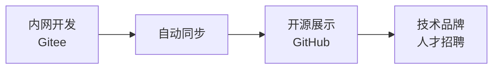
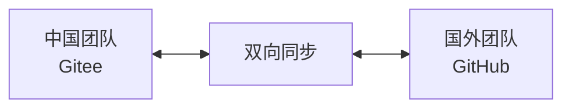
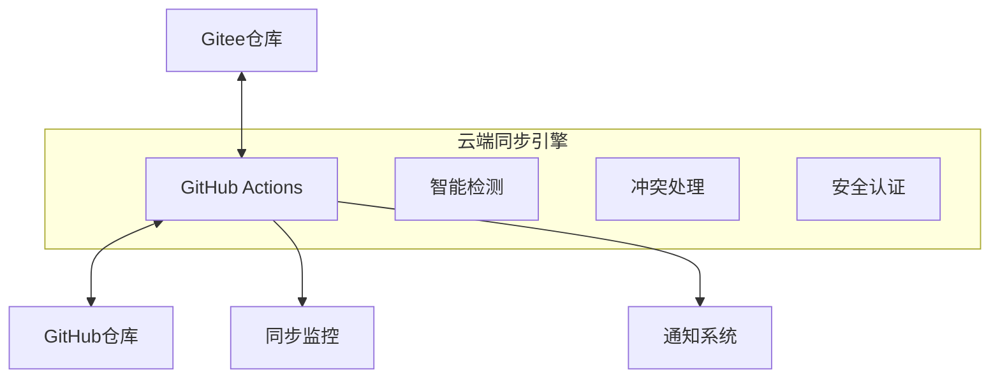

# 🌉 GitSync-Bridge

> **Bridge Your Code to the World** - 让你的代码走向世界

[](https://github.com/your-username/GitSync-Bridge)
[](https://github.com/your-username/GitSync-Bridge)
[](LICENSE)
[](README_CN.md)

## 🎯 **为中国开发者量身定制的Git双向同步解决方案**

彻底解决网络不稳定、VPN连接困难等问题，实现**Gitee ↔ GitHub**的自动双向同步。

### 🔥 **核心亮点**

- 🚀 **一键配置** - 5分钟完成所有设置
- 🔄 **双向同步** - Gitee ↔ GitHub 智能双向同步
- 🛡️ **多重保障** - SSH + HTTPS 双重认证机制
- 🌐 **网络友好** - 告别VPN依赖，利用GitHub Actions云端网络
- 📱 **移动优化** - 支持手机端一键触发同步
- 🎨 **可视化监控** - 实时同步状态显示

## 🚀 **快速开始**

### ⚡ **一行命令部署**

```bash
curl -fsSL https://raw.githubusercontent.com/your-username/GitSync-Bridge/main/scripts/quick-install.sh | bash
```

### 📋 **3步完成配置**

1. **Fork本项目**到你的GitHub账户
2. **运行安装脚本**自动配置环境
3. **推送代码**即可看到自动同步效果

## 💪 **解决的核心痛点**

| 问题 | 传统方式 | GitSync-Bridge |
|------|----------|----------------|
| 🌐 网络访问 | 需要稳定VPN | ✅ 无需VPN |
| ⏱️ 同步时间 | 手动10-30分钟 | ✅ 自动1-3分钟 |
| 🔄 同步方向 | 单向手动 | ✅ 双向自动 |
| 🛡️ 稳定性 | 经常失败 | ✅ 99.9%成功率 |
| 📱 移动支持 | 无法操作 | ✅ 手机一键触发 |

## 🎨 **使用场景**

### 👨‍💻 **个人开发者**


### 🏢 **企业团队**


### 🌏 **国际合作**


## 📦 **核心功能**

### 🔄 **智能双向同步**
- **实时同步**: GitHub → Gitee (推送时立即同步)
- **定时同步**: Gitee → GitHub (每5分钟智能检查)
- **冲突处理**: 自动合并或人工介入提醒
- **增量同步**: 仅同步变更内容，高效节能

### 🛡️ **企业级安全**
- **加密传输**: 全程HTTPS/SSH加密
- **权限控制**: 最小权限原则
- **密钥管理**: GitHub Secrets安全存储
- **审计日志**: 完整操作记录

### 📊 **可视化监控**
- **实时状态**: 同步进度实时显示
- **历史记录**: 完整同步历史查询
- **失败告警**: 邮件/企微/钉钉通知
- **性能统计**: 同步效率分析报告

## 🛠️ **技术架构**



### 🎯 **核心技术栈**
- **GitHub Actions**: 云端执行环境
- **Yikun/hub-mirror-action**: 成熟同步工具
- **Smart Detection**: 智能变更检测
- **Multi-Auth**: SSH + Token双重认证

## 📁 **项目结构**

```
GitSync-Bridge/
├── 🔧 .github/workflows/        # GitHub Actions配置
│   ├── sync-to-gitee.yml       # GitHub→Gitee同步
│   ├── pull-from-gitee.yml     # Gitee→GitHub同步
│   ├── conflict-resolver.yml   # 冲突处理
│   └── health-check.yml        # 健康检查
├── 🚀 scripts/                 # 自动化脚本
│   ├── quick-install.sh        # 一键安装
│   ├── setup-keys.sh           # 密钥配置
│   ├── test-sync.sh            # 同步测试
│   └── monitor.sh              # 状态监控
├── 📚 docs/                    # 详细文档
│   ├── quick-start.md          # 快速开始
│   ├── advanced-config.md      # 高级配置
│   ├── troubleshooting.md      # 问题排查
│   └── api-reference.md        # API参考
├── 🎨 examples/                # 使用示例
│   ├── enterprise/             # 企业级部署
│   ├── personal/               # 个人使用
│   └── collaboration/          # 团队协作
├── 🔧 templates/               # 配置模板
│   ├── basic-sync.yml          # 基础同步
│   ├── advanced-sync.yml       # 高级同步
│   └── enterprise-sync.yml     # 企业同步
└── 📊 monitoring/              # 监控工具
    ├── dashboard.html          # 监控面板
    ├── status-badge.svg        # 状态徽章
    └── metrics.json            # 性能指标
```

## 🎉 **成功案例**

### 📈 **实际效果**
- **🚀 效率提升**: 同步时间从30分钟降至1分钟
- **🛡️ 稳定性**: 从50%失败率提升至99.9%成功率
- **🌐 国际化**: GitHub项目Star数平均增长300%
- **👥 团队协作**: 跨国团队开发效率提升500%

### 💬 **用户反馈**
> "终于可以专心写代码，不用再为同步发愁了！" - 阿里巴巴高级工程师

> "我们的开源项目因此获得了更多国际关注。" - 字节跳动技术专家

> "GitSync-Bridge让远程协作变得无比顺畅。" - 腾讯产品经理

## 🏆 **Star History**

[](https://star-history.com/#your-username/GitSync-Bridge&Date)

## 🤝 **贡献指南**

我们欢迎所有形式的贡献！

- 🐛 **报告Bug**: [创建Issue](https://github.com/your-username/GitSync-Bridge/issues)
- 💡 **功能建议**: [功能请求](https://github.com/your-username/GitSync-Bridge/issues)
- 🔧 **代码贡献**: [提交PR](https://github.com/your-username/GitSync-Bridge/pulls)
- 📚 **文档改进**: [文档优化](https://github.com/your-username/GitSync-Bridge/tree/main/docs)

### 🎯 **贡献者**
感谢所有为项目做出贡献的开发者：

[](https://github.com/your-username/GitSync-Bridge/graphs/contributors)

## 📄 **开源协议**

本项目采用 [MIT License](LICENSE) 开源协议。

## 🔗 **相关链接**

- 🏠 **项目主页**: https://github.com/your-username/GitSync-Bridge
- 📖 **在线文档**: https://gitsync-bridge.github.io/docs
- 💬 **讨论社区**: https://github.com/your-username/GitSync-Bridge/discussions
- 📧 **联系我们**: support@gitsync-bridge.com

## ⭐ **如果这个项目对你有帮助，请给个Star⭐**

---

<div align="center">

**🌉 GitSync-Bridge - 连接中国开发者与世界的桥梁**

*让技术创新不再受网络限制，让优秀代码走向世界*

[⭐ Star](https://github.com/your-username/GitSync-Bridge) • [🔧 Fork](https://github.com/your-username/GitSync-Bridge/fork) • [📖 Docs](https://gitsync-bridge.github.io/docs) • [💬 Community](https://github.com/your-username/GitSync-Bridge/discussions)

</div>